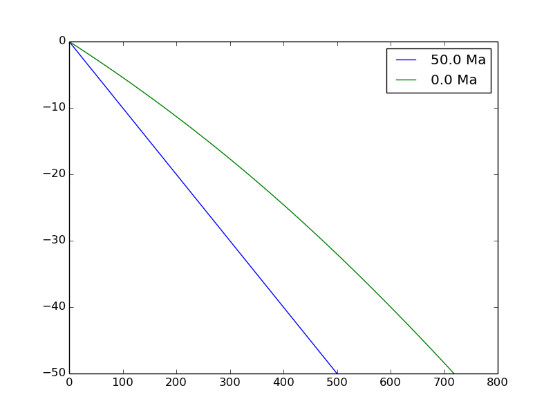

# Lab-exercise-6
This exercise is part 1 of the exercises on thermochronology.
In this exercise you will run a transient 1D thermal model, plot predicted geotherms and predict thermochronometer ages for several thermochronometers.

## Overview
This two-part set of exercises is designed to give you a better understanding of thermochronology and the thermal field in the Earth's crust.
Thermochronology combines many aspects of what has been studied in this course, including the advection and diffusion equations, tectonic and surface (erosional) processes and some basic geostatistics.
The first part of the laboratory exercises on thermochronology is intended to provide an understanding of heat advection and diffusion in the Earth's crust, the time-dependence of thermal processes, and how a thermal history can be used to predict thermochronometer ages.

## Getting started
1. You can start by making a folder to store files for this week's exercises in a Terminal.

    ```bash
    $ cd Desktop
    $ mkdir Lab-6
    $ cd Lab-6
    ```
**Reminder**: the `$` symbol above represents the command prompt in the Terminal window.
2. Now you can open **Spyder**.

    ```bash
    $ spyder
    ```

Now we are ready to start.

## Time-dependent temperature in the Earth
In this exercise we will use an analytical solution to the 1-D time-dependent thermal advection-diffusion equation to simulate erosion of rock at the Earth's surface, the upward transport of the underlying rock toward the surface and the changes in a 1-D geotherm with time.
The basic equation for temperature *T* as a function of depth *z* and time *t* was originally published by Carslaw and Jaeger (1959)

<br/> *Equation 1. 1D time-dependent heat advection-diffusion equation.*

where *G* is the initial geothermal gradient (increase in temperature with depth), *v*<sub>*z*</sub> is the vertical advection velocity (positive upward), *κ* is the thermal diffusivity and `erfc()` is the complementary error function, defined as

<br/> *Equation 2. The complementary error function.*

With this equation, the temperature initially increases linearly with depth (*T*(*z*,*t*=0) = *Gz*) and the geotherm will evolve with time as a function of the advection velocity and thermal diffusivity.

## Problem 1 - The time dependence of rock advection
We will begin by plotting geotherms to get a sense of how our temperature equation works.

1. If you [download a copy of the Python script `age_predict_1D.py`](age_predict_1D.py) you should be able to run it without making any changes to produce a plot like that shown below.

    <br/>
    *Figure 1. 1D transient thermal solution including advection.*<br/><br/>
To start, please add axis labels and a title to this plot. **What is the advection velocity for this thermal solution?** Add a text label listing the advection velocity on your the plot using the `plt.text()` function, then save a copy of the plot at the end of this document.
2. **How does the thermal solution change when you alter the advection velocity?** Increase the advection velocity to 1.0 mm/a and save the resulting plot at the end of this document. Do the same thing for an advection velocity of 0.1 mm/a. **What is the effect of changing the advection velocity on temperatures in the shallow crust (<10 km depth)?**
3. Reset the advection velocity to the starting value. Now increase the total simulation time to 100 Ma. Once again, save a copy of this plot at the end of this document. **What happens to temperatures in the model as the simulation time increases?** You might want to run some additional calculations (you don't need to save the plots) with even longer simulation times (1000 Ma, 5000 Ma, etc.). **What do you observe for the temperatures in the model? Are there any potential problems with these temperatures? Does the model approach a steady-state thermally?**
4. Reset the simulation time to 50 Ma. Now we'll explore the effect of the initial thermal gradient. Increase the initial thermal gradient to 20°C/km, run the model and save the plot. Do the same for a thermal gradient of 5°C/km. **How does the thermal gradient affect the temperatures in the model? Is there any clear relationship between the initial thermal gradient and the maximum temperature in the model at *t* = 0 Ma?**
5. Lastly, reset the initial thermal gradient to 10°C/km. Increase the number of temperature calculations to plot from 1 to 5 and run the thermal model. Save this plot and insert it at the end of this document. **In your opinion, is it helpful to see the temperature calculations at different times?**

## Predicting thermochronometer ages
Thermochronometers record the time since a rock or mineral was at a given temperature (closure temperature) in the Earth.
Above, we have calculated temperature solutions assuming 1-D vertical advection of rock.
Here, we will track rocks through the thermal field with time and use their recorded thermal history to predict thermochronometer ages.
The key to understanding what is done here is to understand that we will be simulating the position of a parcel of rock at depth in the earth, and at each time step the position of the rock parcel will be moved upward according to the length of the time step multiplied by the advection velocity.
In mathematical terms, this relationship is

<br/> *Equation 3. Equation for calculating rock particle depth as a function of time.*

Thus, we will track a parcel of rock from some depth in the model at time *t*=0 to the surface when the simulation is complete at 0 Ma.
At each depth position, the temperature of the parcel of rock will be recorded, which will allow the thermal history of the rock parcel to be used to predict different thermochronometer ages.
We will consider the apatite (U-Th)/He, zircon (U-Th)/He and muscovite <sup>40</sup>Ar/<sup>39</sup>Ar thermochronometers that were presented briefly in lecture.

Thermochronometer closure temperatures will be predicted using Dodson's method, which was also discussed briefly in lecture.
According to Dodson's method, the closure temperature *T*<sub>c</sub> of a thermochronometer is

<br/> *Equation 4. The effective closure temperature according to Dodson's method.*

where *E*<sub>a</sub> is the activation energy, *R* is the universal gas constant, *A* is a geometric factor (*A* = 25 for a sphere, *A* = 8.7 for a planar sheet), *τ* is time for the diffusivity to decrease by a factor of 1/e, *D*<sub>0</sub> is the diffusivity at infinite temperature and *a* is the diffusion domain (we'll assume this is the size of the mineral). The value of *τ* can be calculated as a function of the cooling rate *dT*/*dt*

<br/> *Equation 5. The characteristic time for a change in diffusivity.*

By simulating cooling of the minerals by iterating over the values of the recorded temperature history from depth to the surface, thermochronometer ages can be predicted for various systems.

## Problem 2 - Cooling ages and their relationship to exhumation rate
One of the main interests for scientists using thermochronology is to determine the exhumation rate of a study area based on the ages of thermochronometer data at the surface.

1. At the top of the Python script [`age_predict_1D.py`](age_predict_1D.py), there are three flags (`True`/`False` variables) that allow you to enable the calculation of different thermochronometers.
Set the value for `calc_AHe` to `True` to enable prediction of apatite (U-Th)/He ages and run the model with the default parameters.
**What is the predicted apatite (U-Th)/He age?**
**What does this age mean?**
**What is the closure temperature for the model in this case?**
If you look carefully through the code, you can find where the closure temperature is calculated.
Add text to your plot to display the predicted apatite (U-Th)/He age and predicted closure temperature using the `plt.text()` function.
I suggest that you add the text functions at the bottom of the script where the predicted apatite (U-Th)/He age is written to the screen (if requested).
Save a copy of the plot and insert it at the end of this document.
2. Similar to above, set the flags for `calc_ZHe` and `calc_MAr` to `True` and add the corresponding `plt.text()` functions to display the predicted zircon (U-Th)/He and muscovite <sup>40</sup>Ar/<sup>39</sup>Ar ages and their predicted closure temperatures.
As above, I suggest that you add the text functions at the bottom of the script where the predicted apatite (U-Th)/He age is written to the screen (if requested).
Save a copy of the plot and insert it at the end of this document.
**Do all of the predicted thermochronometer ages make sense?**
3. To understand more about how the thermochronometer ages are predicted, it can he helpful to look at the temperature-depth history of the parcel of rock as it travels from depth to the surface.
You can see this history visually by setting the flag `plot_Tzhist` to `True` at the top of the Python script.
This will add a set of symbols to the plot that display how the temperature and depth of the rock parcel changes with time.
**Considering the predicted thermochronometer ages and closure temperatures, do you see any problems with the predicted ages now?**
Save a copy of this plot and insert it at the end of this document.
4. Finally, increase the advection velocity in the thermal model to 1.0 mm/a and produce a similar plot to above.
**Do the predicted thermochronometer ages make more sense now?**
**What was the problem in questions 2 and 3?**
Save a copy of this plot and insert it at the end of this document.

## What to submit
**For this exercise, your modifications to the end of this document should include**

1. The 7 plots requested for problem 1 and the 4 plots requested for problem 2.
2. Figure captions for each plot describing the plot as if it were in a scientific journal article.
3. Answers to all of the questions in bold
4. Copies of your modified Python scripts for Problems 1 and 2

**NOTE**: You may want to reference these plots in your final report on these exercises, so be sure to keep the copies of the plot files.

## References
Carslaw, H. S., & Jaeger, J. C. (1959). Conduction of heat in solids. Oxford: Clarendon Press.

Dodson, M. H. (1973). Closure temperature in cooling geochronological and petrological systems. Contributions to Mineralogy and Petrology, 40(3), 259–274.

# Answers
## Problem 1
This is some text. You can use *italics* or **bold** text easily. You may want to read a bit more about [formatting text in Github-flavored Markdown](https://help.github.com/articles/basic-writing-and-formatting-syntax/). You can see an example of how to display an image with a caption below.

<br/>
*Figure 2: Sine wave calculated from 0 to 2π*
